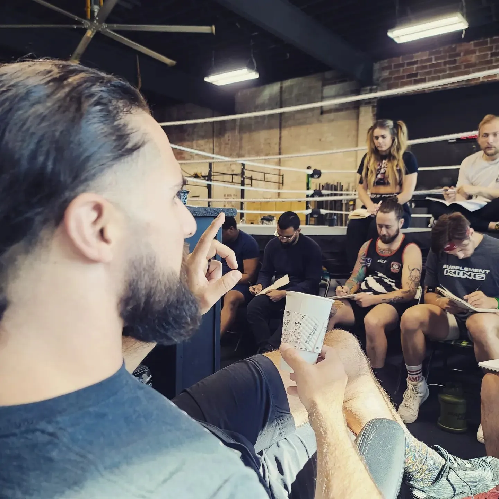
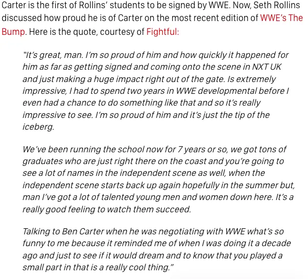
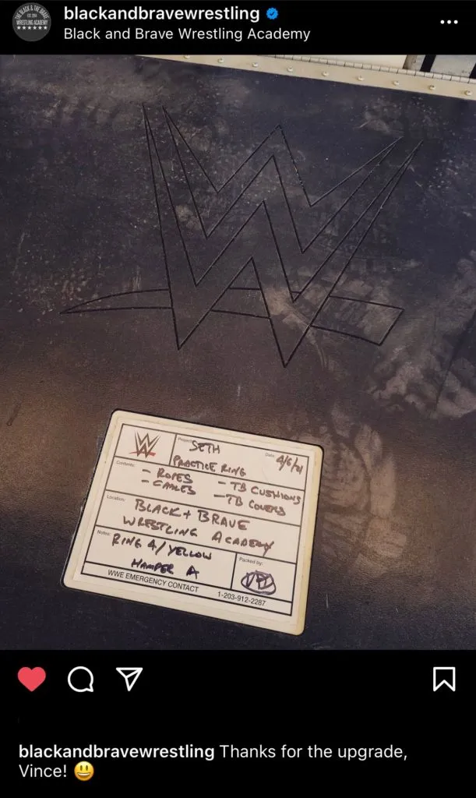

---
# https://docusaurus.io/docs/api/plugins/@docusaurus/plugin-content-blog#markdown-front-matter
title: Black x Brave Wrestling Academy - Training with Seth Rollins in Davenport, Iowa
date: 04-06-2023
description: The Black x Brave Wrestling Academy has been developing talent since 2014. The facility, located in Davenport, Iowa, is equipped with a WWE ring and wide range of gym equipment. Read more about how to train at Seth Rollins' pro wrestling school including the programs they offer and the cost to attend.
keywords: [Seth Rollins, WWE, Black X Brave Wrestling Academy]
slug: black-x-brave-wrestling-academy-training-with-seth-rollins-in-davenport-iowa
authors: [jalenwu]
tags: [wwe, wwe performance center]
# image: 
hide_table_of_contents: false
---

Are you an aspiring pro wrestler searching for a top-notch training facility? Look no further than Seth Rollins' Black x Brave Wrestling Academy in Davenport, Iowa.

Located in Davenport, Iowa, the academy is conveniently located near several major cities, including Chicago, Des Moines, Minneapolis, Kansas City, and St. Louis. Students can easily reach the academy via public transportation, with options including Amtrak and Greyhound.
<!-- truncate -->

One of the standout features of the Black x Brave Wrestling Academy is its affordable housing options. For just $300 a month, students can rent bunks and stay on site, allowing them to fully immerse themselves in their training.

The academy's trainers are some of the best in the business, with Seth Rollins, Marek Brave, and Matt Mayday all offering their expertise to students. The academy has also produced several successful pro wrestlers, including Nathan Frazer, Zicky Dice, and Frontman Jah.

  
_source:_ _[wrestletalk](https://wrestletalk.com/news/seth-rollins-is-proud-of-nxt-uk-star/)_

The academy's 12-week program is open to men and women over the age of 18, and includes access to open ring times and unlimited access to QC Crossfit training. Students also have the opportunity to help at local independent promotions, providing valuable networking opportunities and a chance to learn the behind-the-scenes aspects of a show.

The next Black x Brave Wrestling Academy training is set to start in January 2024, with additional dates in May and September. The 12-week program runs on Tuesdays, Wednesdays, and Thursdays from 11am to 2pm, with opportunities for weekend travel to independent promotions.

Tuition for the 12-week program is $3,500, which includes access to the gym equipment, ring times, and QC Crossfit training. For students who require housing, the total cost is $4,400, with $900 allocated for lodging. Tuition prices will increase in 2025 to $4,000, so aspiring pro wrestlers should act now to secure their spot at the academy.

The Black x Brave Wrestling Academy boasts top-of-the-line equipment, including a WWE ring gifted by Vince McMahon himself. 

  
_source:_ _[pwmania](https://www.pwmania.com/vince-mcmahon-gives-new-ring-to-seth-rollins-black-brave-academy)_  

With a focus on quality training, affordable housing, and valuable networking opportunities, the academy is the perfect place for any aspiring pro wrestler to hone their craft and pursue their dreams.

Don't miss your chance to train with some of the best in the business - [contact the Black x Brave Wrestling Academy today](https://www.blackandbravewrestling.com/new-page) to secure your spot in the next training session.

