---
# https://docusaurus.io/docs/api/plugins/@docusaurus/plugin-content-blog#markdown-front-matter
title: 2015 WWE Performance Center Trainees; Where Are They Now?
date: 04-14-2023
description: A deep dive into the 2015 WWE Performance Center trainees. From their beginnings in WWE’s developmental program to where they are today, this article breaks down their careers and current status.
keywords: [WWE Performance Center, WWE Trainees 2015, WWE Developmental, Pro Wrestling, NXT]
slug: 2015-wwe-performance-center-trainees-where-are-they-now
authors: [jalenwu]
tags: [wwe, wwe performance center]
# image: 
hide_table_of_contents: false
---

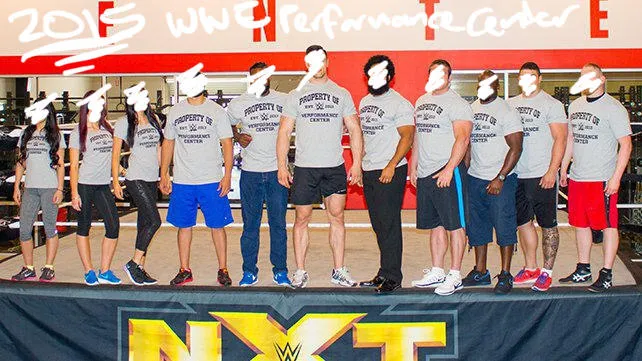

Ah, 2015. Back when we were all binge watching Breaking Bad spinoffs, freaking out over Mad Max: Fury Road, and wondering how the Avengers franchise could get any bigger. Meanwhile, over at WWE, they were busy assembling a new batch of trainees at the Performance Center, their (all?) elite wrestling school that’s produced some of today’s biggest stars. Now, let’s take a look at where those 2015 hopefuls are in 2023. Spoiler alert: some made it big, some fizzled out, and others found success outside the WWE machine.
<!-- truncate -->

--- 

## 🇦🇺 Australia Representing: The Iconic Duo

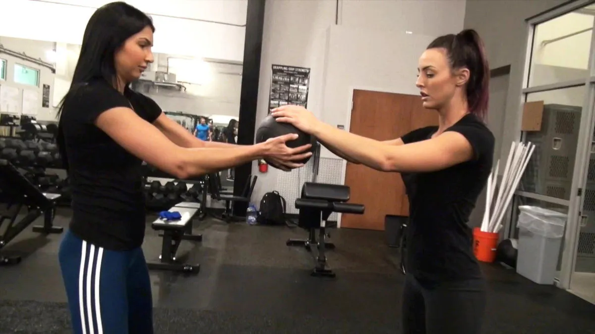
### Cassie McIntosh aka Peyton Royce aka Cassie Lee (Born in Sydney, resided in Melbourne, Australia)

We gotta start with Cassie McIntosh, who, along with Jessica McKay, formed The IIconics. If this were 2015, you’d find her in NXT honing her craft, but by 2018, she was tearing up the main roster. Released in 2021, she and McKay found themselves heading to Impact Wrestling under the name “The IInspiration.” Cassie stepped away from the ring to focus on her family but recently hinted at a possible WWE return for the Royal Rumble. Because, let’s be honest, who doesn’t want a pop like Daniel Bryan’s in 2014? She is currently taking time away to care for her newborn with ~~AEW~~ WWE NXT superstar, Shawn Spears.  

Status: Inactive (but maybe not for long…)

**Update: May 17, 2024**   
Certainly! When interviewed by Ring The Belle, Cassie Lee (formerly known as Peyton Royce) expressed openness to potentially returning for the WWE Royal Rumble. She stated:  
> Yeah, I’m open to it, for sure. I would love that. It’d be so good to catch up. I mean, it’s the Royal Rumble. We said no last time because we were still pretty hurt about [getting released]. But I feel healed now, and I feel like I’d love to do that if the opportunity came.  

source: [Wrestlezone](https://www.wrestlezone.com/news/1473605-cassie-lee-peyton-royce-would-be-open-to-potential-wwe-royal-rumble-appearance)

Status: Inactive

### Jessica McKay aka Billie Kay (Sydney, Australia)

Jessica McKay took the same path as her bestie, Cassie. Training in Australia, jumping to NXT, and eventually becoming one-half of the WWE Women’s Tag Team Champions. Released the same day as Cassie, she made a brief stop in Impact Wrestling before turning her attention to acting and modeling. If you check her [Instagram](https://www.instagram.com/jessicamckay/?hl=en), she’s living that post-wrestling life but still in the limelight.

Status: Inactive

--- 

## 🇨🇦 From Canada to WWE Stardom

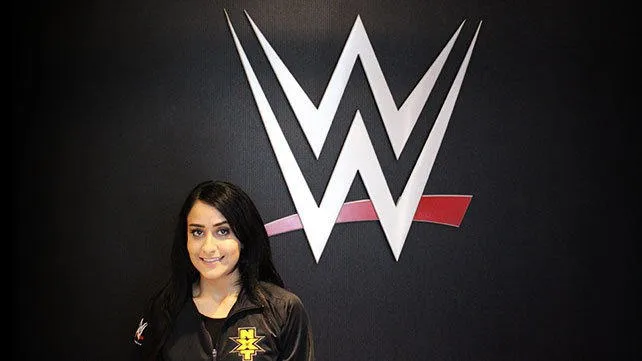
### Nhooph Al-Areebi Aka Aliyah (Toronto, Ontario, Canada)

Remember when The Weeknd was dominating the charts in 2015? That’s when Nhooph Al-Areebi, known as Aliyah, was entering the WWE Performance Center. Her circus school background (yes, really) helped her become one of the more agile performers in NXT. After a long stint in developmental, Aliyah finally made it to the main roster in 2021. Unfortunately, injuries sidelined her, and in 2023, she was quietly released. Twitter may have moved on, but the Aliyah stans are still holding out hope.

Status: Inactive (released in 2023)

---

## 🇩🇪 European TakeOver
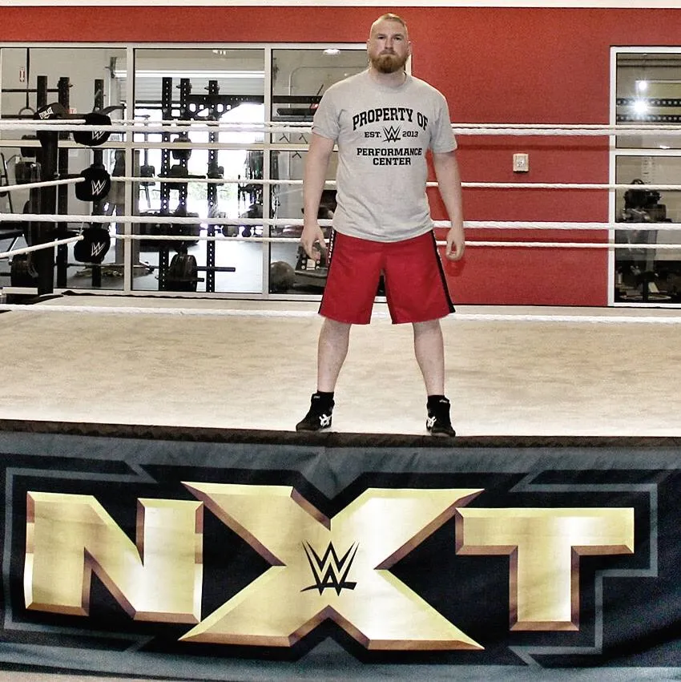
### Axel Tischer Aka Alexander Wolfe (Dresden, Germany) 

Remember when SAnitY was a thing? Axel Tischer, known as Alexander Wolfe, was part of the chaotic faction that made waves in NXT before heading to the main roster. After SAnitY disbanded, Wolfe found success in NXT UK but was released in 2021. He’s now tearing up the indie scene across Europe. If you miss that hardcore European style, Wolfe’s your guy.

Status: Active (Independents)

---

## 🇲🇽 Mexico’s Lucha Libre Legacy
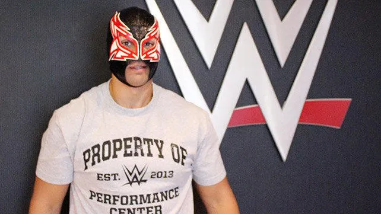
### Oscar Vasquez Aka Magno (Ciudad Juarez, Mexico) 
Oscar Vasquez, better known in lucha circles as Magno, had all the hype when he joined the WWE Performance Center in 2015. His roots in Mexican wrestling showed potential, but he never quite broke out of the NXT bubble. After a quiet exit from WWE in 2016, he’s been doing the lucha libre circuit, but recent matches are sparse.

Status: Unknown (last match documented was from May 5, 2022 for Lucha VaVoom)

---

## 🇷🇸 From Greco-Roman Wrestling to WWE: Serbia’s Hope
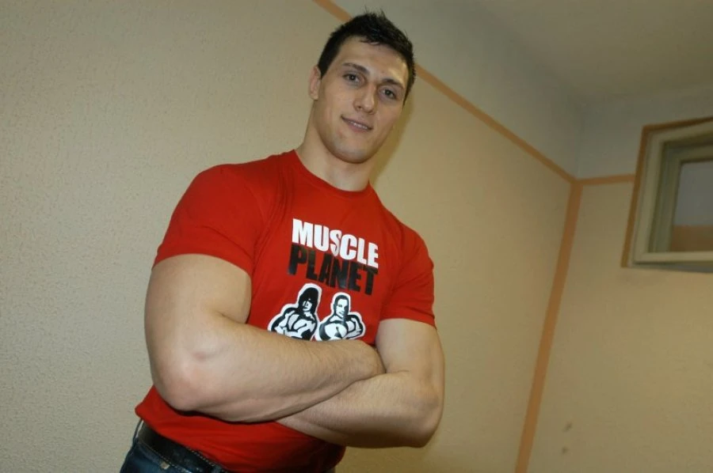
### Radomir Petkovic Aka King Constantine from Belgrade, Serbia 

Every WWE class needs a wildcard, and for 2015, that was Radomir Petkovic. A Greco-Roman wrestling champion with legit Olympic-level talent, Petkovic looked poised to be a surefire success. But wrestling success didn’t come as easily as medals, and he was cut after a year. He’s since disappeared from the wrestling scene.

Status: Inactive

---

## 🇬🇧 UK’s Rugby Star Turned Wrestler
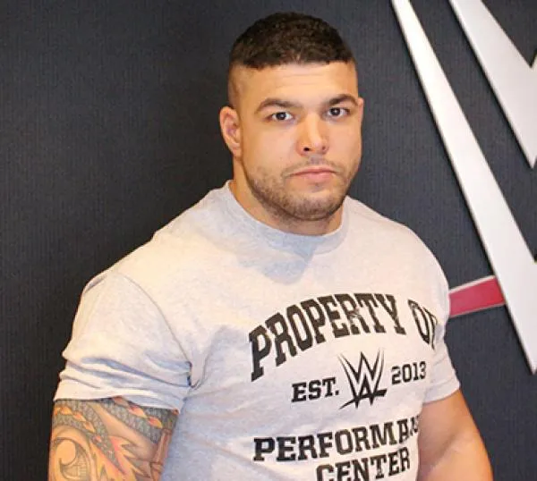
### Peter Howard (Exeter, England)

Peter Howard had a rugby player’s build and potential, but like an injury-prone NFL draft pick, his WWE career was over before it really began. A former discus champ, Howard didn’t catch on in WWE, leaving the company in 2016. Since then? No updates. Another “what could have been” story in the WWE talent pipeline.

Status: Inactive 

---

## 🇺🇸 USA Representing: The Stars of the Class

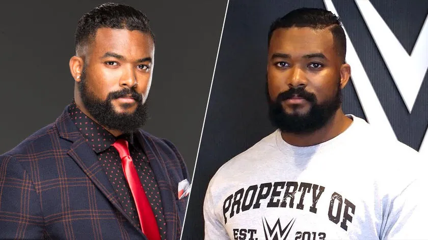
### Kenneth Crawford Aka Montez Ford (Chicago, Illinois/Anson County, North Carolina) 

While Empire was dominating TV, Kenneth Crawford, now known as Montez Ford, was on his way to becoming one-half of The Street Profits. In 2015, he was just getting his feet wet in WWE, but fast forward to today, and he’s a multi-time WWE Tag Team Champion and one of the most charismatic guys on the roster. If The Rock ever needs a protégé, Ford’s ready.

Status: Active (WWE)

---

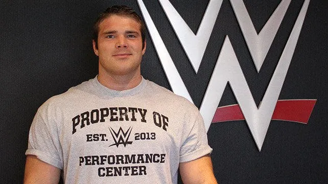
### Thomas Kingdon (Traverse City, Michigan)

Thomas Kingdon had the bodybuilder look Vince McMahon usually loves, but, as we know, muscle doesn’t always translate to wrestling stardom. Released in 2016, Kingdon has mostly stayed out of the wrestling spotlight since. Probably sipping protein shakes and reminiscing about the WWE days.

Status: Inactive

---

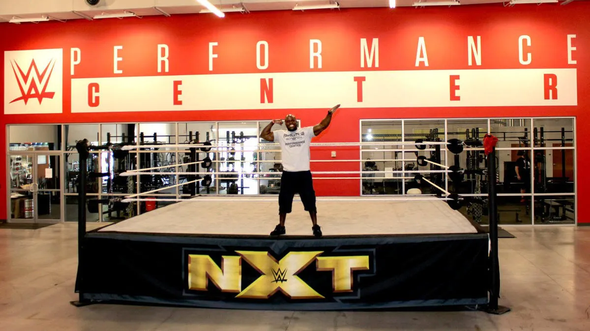
### Sesugh Uhaa Aka Apollo Crews (Atlanta, Georgia)

Sesugh Uhaa, known in WWE as Apollo Crews, had all the tools when he arrived in 2015 — insane athleticism, a background with Dragon Gate, and a whole lot of buzz. After a solid main roster run, he moved back to NXT in 2022, where he’s still kicking it today. When you can do a standing moonsault like Crews, there’s always a spot for you.

Status: Active (WWE)

---

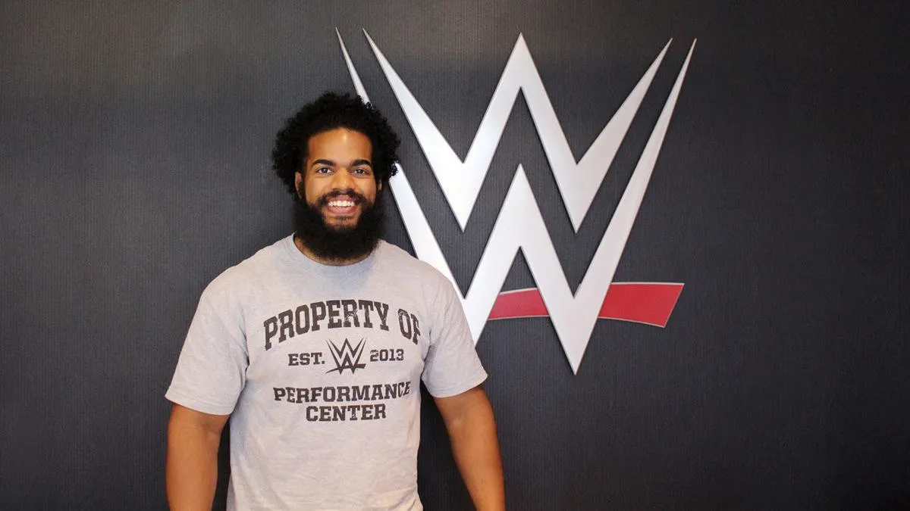
### Levis Valenzuela Jr. (Durham, North Carolina) 

Levis trained with CWF Mid-Atlantic in 2013 and wrestled mostly for them until 2015 when he earned a spot on the 2015 WWE Performance Center class. He debuted as No Way Jose on NXT in 2016 and got called up to the main roster in 2018. He was eventually released from the WWE in 2020. He made a brief appearance with Impact! Wrestling and has been seen on a few independent shows.  

Status: Active (Independents)

--- 

## How did the 2015 WWE Performance Center trainees do?
### Out of 11 performers...
* 2 are active in the WWE (Montez Ford, Apollo Crews)
  * 18% of that class are currently active in the WWE
* 7 are inactive or status is unknown
  * 64% of that class are currently not active in the pro wrestling industry
* 2 are active on the independents
  * 18% of that class are currently active outside of WWE

---

The class of 2015 was like the Mad Max: Fury Road of WWE developmental. Some became breakout stars, others faded into obscurity, but hey, that’s the wrestling biz.

## Additional reading:
[WWE article published on April 13, 2015](https://www.wwe.com/shows/wwenxt/wwe-performance-center-welcomes-new-class-of-recruits)