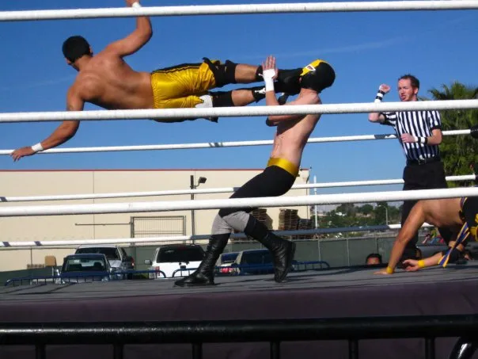

## Who Is Jalen Wu? 

Hola! I'm Jalen Wu, the former pro wrestler turned wrestling analyst, the guy behind bumpXfeed, and your go-to source for all things wrestling. If you’ve ever wondered what it’s like to transition from taking bumps in the ring to breaking down those same bumps with data and passion, you’re in the right place.

### My Wrestling Journey

I laced up my boots and stepped into the wild world of pro wrestling back in 2009. My story started with a fateful reach out to Bryan Alvarez... yes, *that* Bryan Alvarez, the voice behind Figure Four Weekly and a walking encyclopedia of wrestling knowledge. Living in Seattle at the time, I asked him where I could get my start, and he pointed me straight to Portland, Oregon, where "Playboy" Buddy Rose and Colonel DeBeers were running a wrestling school out of [Straight Blast Gym](https://www.straightblastgym.com). Every Sunday, I made the two hour trek to get slammed and learn the ropes, literally and figuratively, right near the Rose Garden.

But the itch to wrestle wasn’t satisfied in Portland. I packed my bags and headed south to California, to train and perform with AWS (Alternative Wrestling Show) based in the City of Industry. And let me tell you, if you know SoCal, you know the traffic’s a nightmare. Think of the 405/10/60 combo at 2 p.m. on a weekday. Yeah, brutal. But it was worth every second of road rage.

In SoCal, I didn’t just wrestle, I thrived. I had the honor of being a tag team champion in NWPW (New Wave Pro Wrestling), and I made a name for myself in IWL (Insane Wrestling League) and a slew of independent lucha promotions all across Los Angeles. My time in the ring taught me everything from the psychology of a match to the sheer grit it takes to make it in this business.

### Why bumpXfeed?

So, why bumpXfeed? After hanging up my boots, I realized I still had a lot to give to the wrestling community. This project is my way of paying it forward, sharing the lessons I learned, the stats that can give you an edge, and the stories that make this industry so damn fascinating. I’m all about the data, but I’m also about the heart that goes into every dropkick, suplex, and title chase. Whether you’re a wrestler looking to up your game or a fan wanting to dive deeper into the sport, bumpXfeed is here to help you succeed.

## Connect with Me

Want to see some of my old matches? Curious about my thoughts on the latest WWE storyline? Or maybe you just want to talk shop? Here’s where you can find me:

- [Jalen Wu's YouTube Channel](https://www.youtube.com/channel/UCrIgygbZ7lxsMbYn29WtSwA)
- [CAGEMATCH Profile](https://www.cagematch.net/en/?id=2&nr=10961)
- [bumpXfeed's X](https://twitter.com/bumpxfeed)
- [bumpXfeed's Facebook](https://www.facebook.com/bumpxfeed/)

### Got Questions?

Whether you’ve got questions, comments, or just want to rant about wrestling, I’m all ears. Drop me a line [here](https://forms.gle/XDcfxC74ocytjtbA6). Let’s talk wrestling!